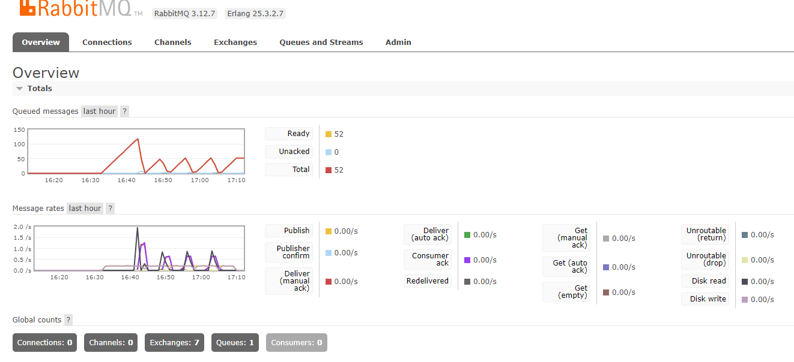

# README - Kubernetes Setup for Queue-Based Scaling

This README provides an overview of a Kubernetes setup for managing a queue system, including creating messages on a queue, dynamically dispatching workers based on queue message counts, and deleting worker pods when the queue becomes empty.

## Prerequisites

Before deploying this setup, make sure you have the following prerequisites in place:

- A running Kubernetes cluster
- `Docker`
- The `kubectl` command-line tool installed and configured to connect to your cluster

## Deployment

1. Create the queue using rabbitMQ.
    ```bash
   kubectl create -f queue.deployment.yml
   ```
2. Create the *publisher* image that create/dispatch messages on the rabbitMQ POD.
   ```bash
   docker build -t rabbitmq-publisher publisher
   kubectl create -f producer.deployment.yml
   ```
3. Create the client/worker pod that dispatch/delete workers when Queue's messages hit specific threshold.
   ```bash
    kubectl create -f consumer.deployment.yml
   ```
4. *(Optional)* Create prometheus server to monitor queue messages at `http://localhost:9090`
   ```bash
    kubectl create -f prometheus.deployment.yml
   ```

## Setup Explanation
The Kubernetes setup consists of the following components:

- **RabbitMQ Service**: This is the message broker used for the queue system. it exposes two ports `15672` for management UI at `http://localhost:15672`, `5672` as the queue protocol.

- **Producer Pods**: They create a queue and seed the queue with messages periodically, so workers can process them.  

- **Client Pods**: The client pod is responsible for listening to the queue messages count and after hitting a specific threshold it will dispatch more workers so they can start processing and after the queue is empty the client will delete the worker PODs.

- **Worker Pods**: These are pods running a Node.js application to process messages from the queue. Worker pods are dynamically created by the Client POD based on queue message counts, when hitting a threshold more pods will be created.

- **CronJob**: A Kubernetes CronJob is used to delete workers daily, in case they were not deleted automatically after finishing processing messages.

- **Monitoring POD**: The rabbitMQ management UI and prometheus PODs provide charts and metrics for monitoring the queue message count, consumers

## Usage

1. Apply the Kubernetes manifests to your cluster using `kubectl apply -f <manifest.yaml>`.

2. Monitor the setup using `kubectl logs` to check the logs of the CronJob and the worker pods.

## Customization

You can customize this setup for your specific use case by adjusting the following:

- The queue message creation interval using env variables `MESSAGE_INTERVALS`, be default it will create a message every 5s.
- Environment variables and configurations in the worker pods.
- Scheduling intervals for the CronJob.
- 
